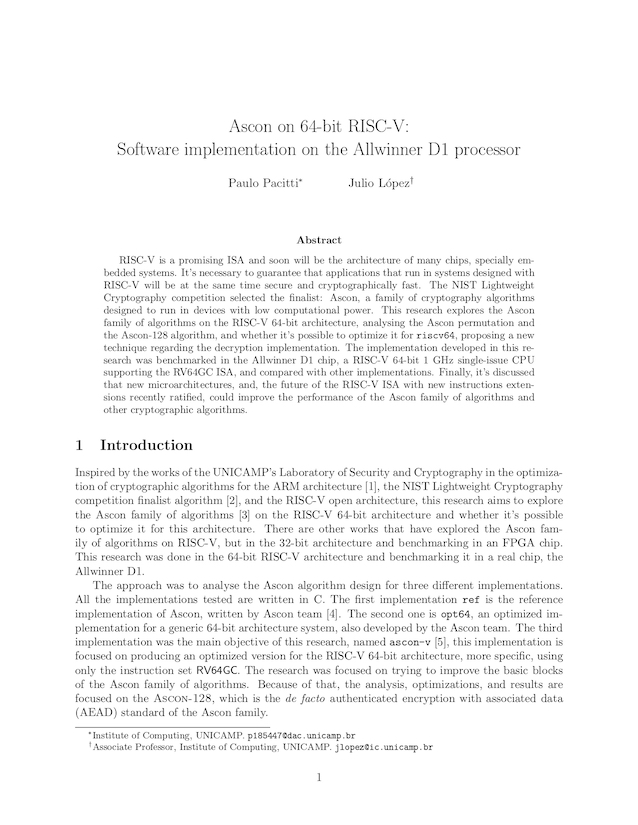

# ascon-v 5️⃣
Ascon lightweight cryptographic algorithm implementation for improved performance on RISC-V. Tested on the Allwinner D1 processor. My bachelor's thesis at [UNICAMP's Institute of Computing](https://ic.unicamp.br/en/).

## Abstract

> RISC-V is a promising ISA and soon will be the architecture of many chips, specially embedded systems. It's necessary to guarantee that applications that run in systems designed with RISC-V will be at the same time secure and cryptographically fast. The NIST Lightweight Cryptography competition selected the finalist: Ascon, a family of cryptography algorithms designed to run in devices with low computational power. This research explores the Ascon family of algorithms on the RISC-V 64-bit architecture, analysing the Ascon permutation and the Ascon-128 algorithm, and whether it's possible to optimize it for `riscv64`, proposing a new technique regarding the decryption implementation. The implementation developed in this research was benchmarked in the Allwinner D1 chip, a RISC-V 64-bit 1 GHz single-issue CPU supporting the RV64GC ISA, and compared with other implementations. Finally, it's discussed that new microarchitectures, and, the future of the RISC-V ISA with new instructions extensions recently ratified, could improve the performance of the Ascon family of algorithms and other cryptographic algorithms.

## Structure

- `lib/`: libraries
- `ref/`: reference [implementation](https://github.com/ascon/ascon-c)
- `opt64`: implementation optimized for 64-bit architectures, made by the Ascon team.
- `src/`: source code for `ascon-v`, optmized implementation for `rv64imac`
- `benchmark/`: performance benchmark comparing the different implmentations
- `tests/`: tests for `ascon-v`
- `tex/`: source files for TeX used for building the essay PDF. The research paper is written in the `tex/main.pdf` file
